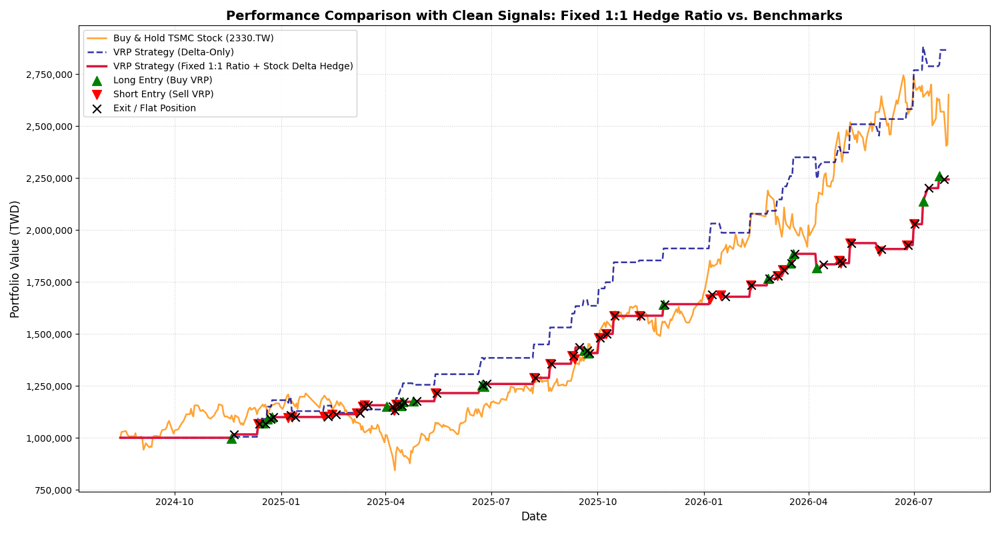

# TSMC Options Volatility Risk Premium Arbitrage Strategy

本專案實作台積電 (2330.TW) 選擇權之波動率溢價套利策略 (VRP Arbitrage)，透過 GARCH 模型預測隱含波動率與實現波動率之價差，並結合 T+0 Delta-Gamma 複合動態避險進行歷史回測與績效分析。

## 交易邏輯與進出場條件 (Trading Strategy & Logic)

本策略透過 **ARMA-GARCH 模型** 預測實現波動度，並與市場選擇權隱含波動度（IV）進行套利：

### 1. 波動率溢價與 Z-Score 訊號計算
* **VRP 價差計算**：
  $$\text{VRP} = \sigma_{\text{implied}} - \sigma_{\text{ARMA-GARCH}}$$
* **Z-Score 標準化**：取前 **60 筆歷史 VRP 資料** 建立滾動視窗（Rolling Window），計算即時 Z-Score 訊號：
  $$Z = \frac{\text{VRP} - \mu_{60}}{\sigma_{60}}$$

### 2. 進出場機制 (Trading Rules)
* **做空 VRP 訊號 ($Z > 1.5$)**：
  * **市場現象**：隱含波動度被顯著高估。
  * **交易組合**：賣出價平選擇權 ($K = S_0$)、買入價外選擇權 ($K = 1.05 \times S_0$) 構成價差組合，並買入 Delta 個數的現貨 ($S_0$) 進行動態對沖。
* **做多 VRP 訊號 ($Z < -1.5$)**：
  * **市場現象**：隱含波動度被顯著低估。
  * **交易組合**：執行與上述相反方向之選擇權與現貨對沖組合。
* **平倉訊號 (Exit Condition)**：
  * 當 Z-Score 回歸至 neutral 區間（$-1.5 \le Z \le 1.5$）時全數平倉出場。
---

## 關鍵績效統計 (Performance Summary)

| 指標 (Metrics) | VRP 策略 (T+0 Delta-Gamma 避險) | 現貨 Buy & Hold |
| :--- | :---: | :---: |
| 夏普比率 (Sharpe Ratio) | 2.38 | 1.99 |
| 卡瑪比率 (Calmar Ratio) | 13.82 | 2.23 |
| 最大回撤 (Max Drawdown) | -3.88% | -30.51% |

專案亮點：相較於標的現貨買入持有策略 (Buy & Hold)，本策略大幅降低了極端市場波動下的下行風險，將最大回撤自 -30.51% 抑制至 -3.88%，展現極佳的風險調整後收益。

---

## 策略績效圖表 (Performance Chart)



---

## 專案目錄結構 (Directory Structure)

```text
Financial Big Data/
├── data/
│   └── TSMC_CDO_Combined.csv     # 預處理後的選擇權與歷史行情數據
├── src/
│   ├── data_import.py             # 資料載入與預處理模組
│   ├── models.py                  # GARCH 模型與 VRP 訊號計算
│   └── back_testing.py            # PnL 計算與 T+0 避險回測邏輯
├── main.py                        # 主程式執行入口
├── .gitignore                     # Git 版本控制忽略設定
├── requirements.txt               # 相依套件清單
└── README.md                      # 專案說明文件
```

## 快速開始 (Quick Start)

1. 安裝環境與必要套件：
   ```bash
   pip install -r requirements.txt
   ```

2. 執行主程式進行回測與繪圖：
   ```bash
   python main.py
   ```